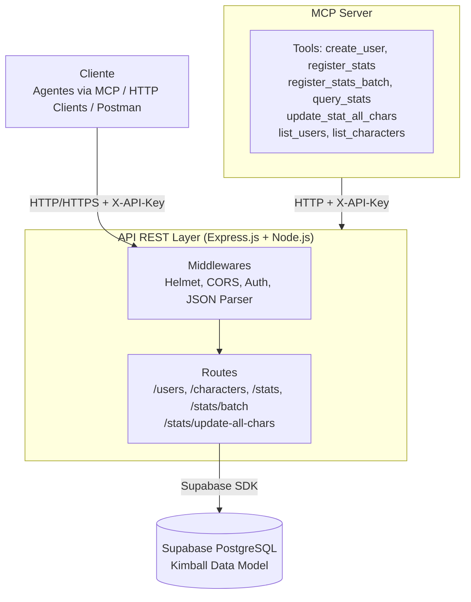
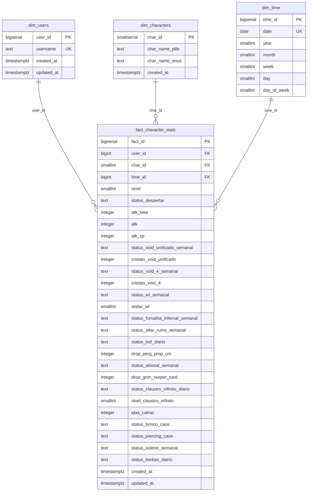
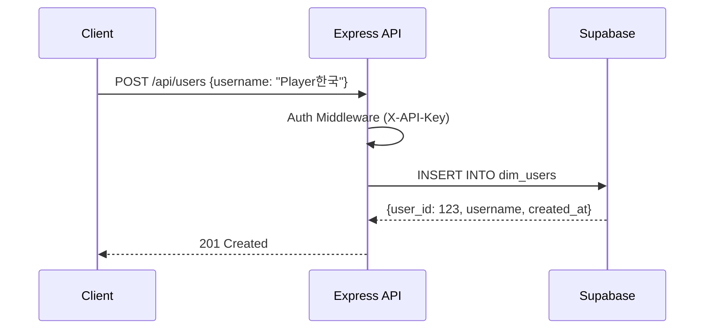
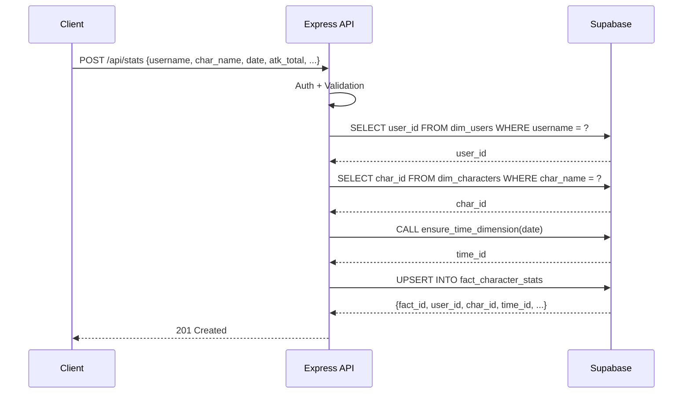
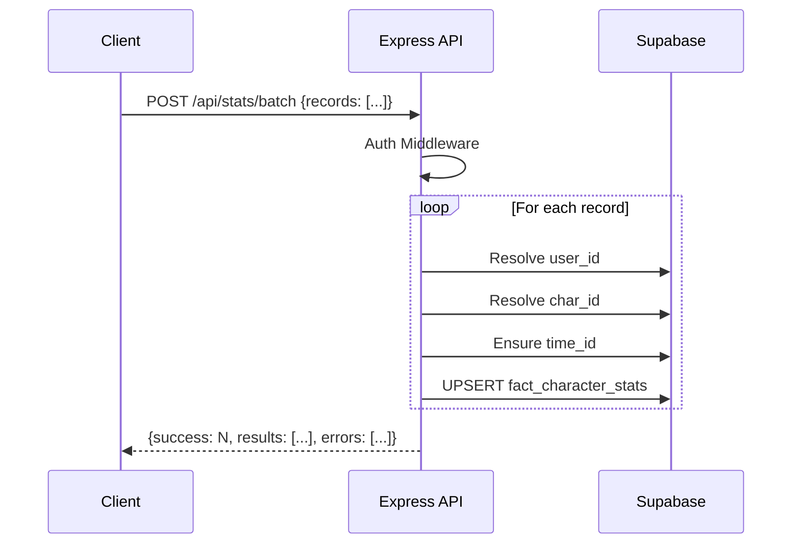
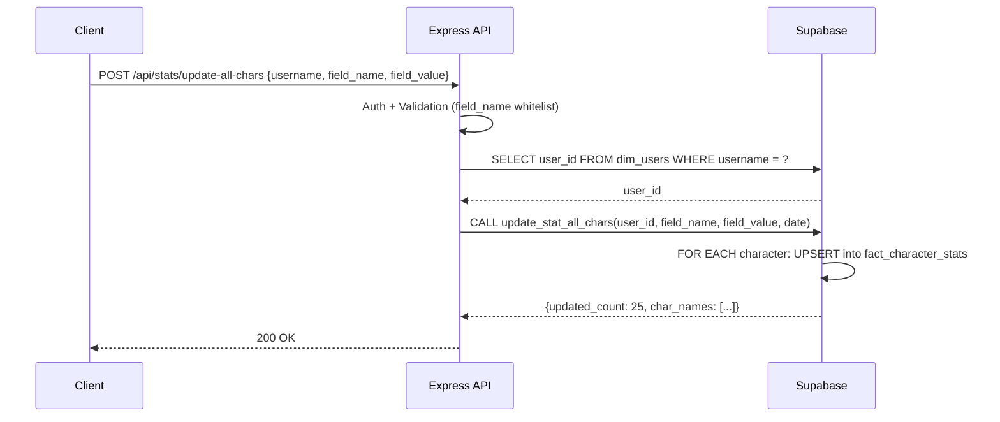
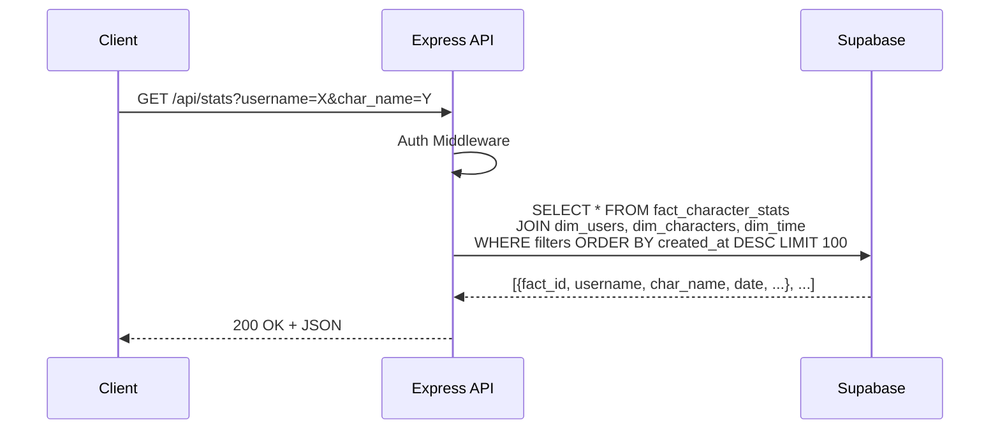
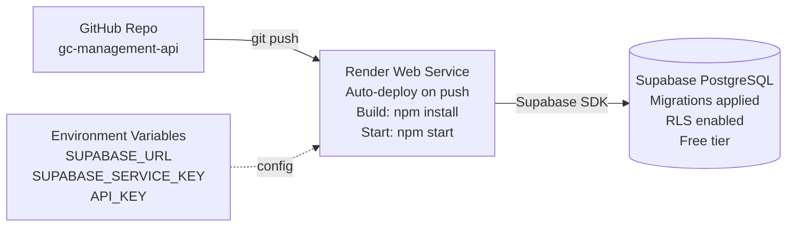

# Architecture - GrandChase Classic API

## Overview

Sistema de rastreamento de personagens e atividades do GrandChase Classic, construído com arquitetura RESTful e modelo dimensional Kimball para análise de dados históricos.

## Stack Tecnológico



## Modelo de Dados - Kimball Dimensional Model

### Diagrama Entidade-Relacionamento (Star Schema)



### Medidas por Categoria

**Character Info:** `nivel`, `status_despertar`

**Combat Stats:** `atk_total`, `atk`, `atk_sp`

**Weekly Activities:** `status_void_unificado_semanal`, `cristais_void_unificado`, `status_void_4_semanal`, `cristais_void_4`, `status_wl_semanal`, `andar_wl`, `status_fornalha_infernal_semanal`, `status_altar_ruina_semanal`, `status_abissal_semanal`, `status_solene_semanal`

**Daily Activities:** `status_tod_diario`, `status_claustro_infinito_diario`, `nivel_claustro_infinito`, `status_berkas_diario`

**Drops & Items:** `drop_perg_prop_uni` (int), `drop_grim_reaper_card` (int), `status_brinco_caos`, `status_piercing_caos`

**Other:** `idas_calnat`

### Índices de Performance

```sql
-- dim_users
idx_dim_users_username ON username

-- dim_time
idx_dim_time_date ON date

-- fact_character_stats
idx_fact_char_stats_user ON user_id
idx_fact_char_stats_char ON char_id
idx_fact_char_stats_time ON time_id
idx_fact_char_stats_created ON created_at DESC
```

## Fluxo de Dados

### 1. Cadastro de Usuário



### 2. Registro de Stats (Individual)



### 3. Registro de Stats (Batch)



### 4. Batch Update (All Characters)



### 5. Consulta de Stats



## Segurança

### Camadas de Proteção

1. **API Key Authentication**
   - Header obrigatório: `X-API-Key`
   - Validado em middleware antes de todos os endpoints protegidos

2. **Row Level Security (RLS)**
   - Habilitado em `dim_users` e `fact_character_stats`
   - Políticas: Public read access (defesa em profundidade)

3. **Service Role Key**
   - Usado apenas no backend
   - Nunca exposto ao cliente

4. **Helmet.js**
   - Headers de segurança HTTP (CSP, XSS Protection, etc)

5. **Input Validation**
   - Validação de campos obrigatórios
   - Sanitização de inputs
   - Tratamento de SQL injection via prepared statements (Supabase SDK)

6. **CORS**
   - Configurado para permitir origens controladas

## Modelo Kimball - Benefícios

### Star Schema

- **1 Fact Table**: `fact_character_stats` (centro)
- **3 Dimension Tables**: `dim_users`, `dim_characters`, `dim_time` (pontas)

### Vantagens

1. **Performance de Queries**: JOINs simples e rápidos
2. **Análise Temporal**: Agregações por dia/semana/mês via `dim_time`
3. **Escalabilidade**: Suporta milhões de registros de stats
4. **Business Intelligence**: Pronto para ferramentas de BI (Metabase, Superset)
5. **Data Warehouse Pattern**: Separação clara entre dimensões e fatos

### Consultas Analíticas Possíveis

```sql
-- Progressão de ATK de um usuário ao longo do tempo
SELECT dt.date, fcs.atk_total
FROM fact_character_stats fcs
JOIN dim_users du ON fcs.user_id = du.user_id
JOIN dim_time dt ON fcs.time_id = dt.time_id
WHERE du.username = 'Player1'
ORDER BY dt.date;

-- Top 10 jogadores por ATK total por personagem
SELECT du.username, dc.char_name_ptbr, MAX(fcs.atk_total) as max_atk
FROM fact_character_stats fcs
JOIN dim_users du ON fcs.user_id = du.user_id
JOIN dim_characters dc ON fcs.char_id = dc.char_id
GROUP BY du.username, dc.char_name_ptbr
ORDER BY max_atk DESC
LIMIT 10;

-- Atividades semanais completadas por mês
SELECT dt.year, dt.month, COUNT(*) as completed
FROM fact_character_stats fcs
JOIN dim_time dt ON fcs.time_id = dt.time_id
WHERE fcs.status_void_unificado_semanal = 'completo'
GROUP BY dt.year, dt.month;
```

## MCP Server Integration

### Tools Disponíveis

```javascript
create_user(username)
  → POST /api/users

list_users()
  → GET /api/users

list_characters()
  → GET /api/characters

register_stats(username, char_name, date, ...stats)
  → POST /api/stats

register_stats_batch(records: [...])
  → POST /api/stats/batch

query_stats(username?, char_name?, from_date?, to_date?)
  → GET /api/stats?filters

update_stat_all_chars(username, field_name, field_value, date?)
  → POST /api/stats/update-all-chars
  → Batch: update 1 field for all 25 characters
```

### Configuração Cliente

```json
{
  "mcpServers": {
    "grandchase": {
      "command": "node",
      "args": ["D:\\gc-management-api\\mcp-server\\index.js"],
      "env": {
        "API_URL": "https://seu-app.onrender.com",
        "API_KEY": "sua-api-key"
      }
    }
  }
}
```

## Deploy Architecture



## Custos Estimados

| Serviço | Tier | Custo |
|---------|------|-------|
| Supabase | Free | $0 (até 500MB DB, 2GB transfer) |
| Render | Free | $0 (750h/mês, sleep após inatividade) |
| **Total** | | **$0/mês** |

### Limites Free Tier

- **Supabase**: 500MB storage, 2GB bandwidth, 50K requests/dia
- **Render**: 750h/mês, sleep após 15min inatividade, 512MB RAM

## Personagens (25 Total)

| # | PT-BR | EN-US |
|---|-------|-------|
| 1 | Elesis | Elesis |
| 2 | Arme | Arme |
| 3 | Lire | Lire |
| 4 | Lass | Lass |
| 5 | Ryan | Ryan |
| 6 | Ronan | Ronan |
| 7 | Amy | Amy |
| 8 | Jin | Jin |
| 9 | Sieghart | Sieghart |
| 10 | Mari | Mari |
| 11 | Dio | Dio |
| 12 | Zero | Zero |
| 13 | Rey | Ley |
| 14 | Lupus | Rufus |
| 15 | Lin | Rin |
| 16 | Azin | Asin |
| 17 | Holy | Lime |
| 18 | Edel | Edel |
| 19 | Veigas | Veigas |
| 20 | Uno | Uno |
| 21 | Decane | Decane |
| 22 | Ai | Ai |
| 23 | Kallia | Kallia |
| 24 | Iris | Iris |
| 25 | Ereb | Ereb |

## Extensibilidade Futura

### Possíveis Adições

1. **Agregações pré-computadas** (tabelas de sumário)
2. **Cache layer** (Redis) para queries frequentes
3. **Webhooks** para notificações
4. **GraphQL API** além do REST
5. **Real-time subscriptions** via Supabase Realtime
6. **Backup automático** de dados críticos
7. **Dashboard web** para visualização

## SQL Functions

### `ensure_time_dimension(input_date DATE)`
Auto-popula `dim_time` com year/month/week/day metadata. Chamada automaticamente em todos os registros de stats.

### `update_stat_all_chars(p_username, p_field_name, p_field_value, p_date)`
Batch update: atualiza 1 campo em todos os 25 personagens da conta.

**Segurança:** Whitelist de 14 campos permitidos (SQL injection protection).

**Campos permitidos:**
- `nivel`, `status_despertar`
- `status_void_unificado_semanal`, `status_void_4_semanal`, `status_wl_semanal`
- `status_fornalha_infernal_semanal`, `status_altar_ruina_semanal`
- `status_tod_diario`, `status_abissal_semanal`, `status_claustro_infinito_diario`
- `status_brinco_caos`, `status_piercing_caos`
- `status_solene_semanal`, `status_berkas_diario`

**Exemplo:**
```sql
SELECT * FROM update_stat_all_chars(
  'oGus', 
  'status_berkas_diario', 
  'Feito', 
  '2026-10-04'
);
-- Retorna: {updated_count: 25, char_names: [...]}
```
